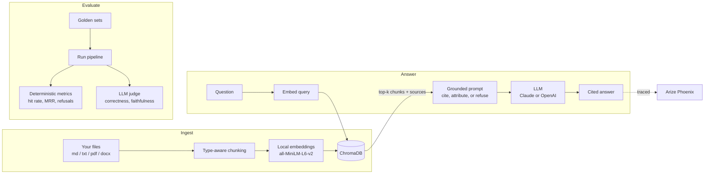

# rag-eval-lab

A retrieval-augmented generation (RAG) assistant for your own documents, built **evaluation-first**: every behavior it claims is backed by a repeatable test, and every answer can be traced end to end.

Ask a question in plain English. The app retrieves the most relevant passages from your files, answers **only** from those passages with `[n]` citations, attributes facts to the right document when several disagree, and says *"I don't know based on the provided documents"* when the answer isn't there.

## Results at a glance

Measured on a 12-question adversarial set (paraphrases, multi-hop, number traps, false premises, near-miss unanswerables) against a knowledge base seeded with deliberately conflicting **distractor documents**. Each figure is the average of 3 runs, with the default model (Claude Sonnet 5.5) generating and judging.

| Metric | Score | What it means |
|---|---|---|
| Faithfulness | 1.0 | No answer made a claim the retrieved passages didn't support |
| Correctness | 1.0 | Answers matched the reference, with correct per-document attribution |
| Correct refusals | 1.0 | Declined every question the documents can't answer |
| False refusals | 0.0 | Never refused a question it could answer |
| Retrieval hit rate | 1.0 | The chunk containing the answer was always in the top 4 |
| MRR | 0.80 | The right chunk was ranked #1 most of the time; distractors sometimes outrank it |

**Model choice, measured.** With Claude Haiku 4.5 as the generator (judge unchanged), correctness is 0.90 and false refusals 0.10 at about half the latency (~1.9 s vs. ~4.0 s per question). Haiku is a supported option for lower-stakes questions; Sonnet is the default because it handles partial and conflicting evidence better.

How these were measured, what broke along the way, and what the numbers do and don't prove: **[docs/EVALUATION.md](docs/EVALUATION.md)**.

## How it works



## Quickstart

Requires Python 3.10+ (3.11 recommended) and an Anthropic or OpenAI API key.

```bash
git clone https://github.com/akhilyenisetty/rag-eval-lab.git
cd rag-eval-lab
python3.11 -m venv .venv && source .venv/bin/activate
pip install --upgrade pip && pip install -r requirements.txt

cp .env.example .env          # then put your API key in .env

python -m rag_eval.ingest     # index everything in data/docs/
python -m rag_eval.ask "How many PTO days do Acme employees get?" --show-context
python -m rag_eval.evaluate --golden data/eval/golden_hard.jsonl
```

Full command reference, adding your own files, tracing setup, and troubleshooting: **[docs/USAGE.md](docs/USAGE.md)**.

## Features

- **Bring your own documents.** Markdown, text, PDF, and Word files, added with one command.
- **Type-aware chunking.** Markdown splits by heading, code by function or class, prose recursively, with a fixed-size fallback.
- **Local embeddings.** Documents never leave your machine to be embedded; only the retrieved passages go to the LLM.
- **Grounded, cited answers.** Every claim cites the passage it came from.
- **Multi-document attribution.** When documents disagree (two companies' PTO policies, say), answers are split and attributed per source instead of blended.
- **Honest refusals.** Out-of-scope questions get "I don't know" instead of a guess, with an optional distance cutoff that skips the LLM call entirely.
- **Pluggable LLM.** Anthropic or OpenAI behind one interface; switching models or providers is a config change, and the eval shows what each choice costs in quality and latency.
- **Evaluation harness.** Golden question sets, source-aware retrieval metrics, an LLM judge, and JSON reports for comparing runs.
- **Tracing.** Optional OpenTelemetry tracing to Arize Phoenix: every question shows the retrieved chunks, exact prompt, response, and token counts.

## Project structure

```
rag-eval-lab/
├── rag_eval/
│   ├── config.py       # all settings: paths, models, chunk size, top-k
│   ├── loaders.py      # file loaders (md / txt / pdf / docx)
│   ├── chunking.py     # type-aware chunking
│   ├── ingest.py       # build the index from data/docs/
│   ├── add.py          # add one file to the knowledge base
│   ├── retrieve.py     # embed query, fetch top-k from ChromaDB
│   ├── llm.py          # provider-agnostic LLM wrapper (Anthropic / OpenAI)
│   ├── generate.py     # grounded prompt, citations, refusals
│   ├── ask.py          # command-line Q&A
│   ├── evaluate.py     # eval harness and LLM judge
│   └── tracing.py      # optional Phoenix / OpenInference tracing
├── data/
│   ├── docs/           # knowledge base (sample handbook + distractor docs)
│   └── eval/           # golden question sets
├── docs/
│   ├── USAGE.md
│   └── EVALUATION.md
├── requirements.txt
└── .env.example
```

## Design decisions

- **Metrics written by hand before adopting a framework.** The harness implements its own retrieval, refusal, and judge metrics so each number is explainable. Rows are saved with Ragas field names (`user_input`, `response`, `retrieved_contexts`, `reference`), so Ragas can score the same runs later.
- **A pinned judge.** The judge model is set separately from the generator, so comparing generators never silently changes the grader.
- **Behavior-based refusal scoring.** The judge classifies each answer as full, partial, or declined, rather than matching an exact refusal phrase that different models word differently.
- **Source-aware evaluation.** A retrieval "hit" only counts if the evidence came from the expected file. Otherwise a distractor document containing the same phrase would fake a pass.
- **The judge sees exactly what the generator saw,** including source labels. Without that, correct attributions get graded as hallucinations (this bug was found and fixed; see EVALUATION.md).
- **Personal, multi-document scope.** Users can upload anything, so the assistant can't assume which organization a question is about. Ambiguous questions are answered per source rather than filtered to one document.
- **Manual tracing spans** using OpenInference conventions instead of SDK auto-instrumentation, so an SDK upgrade can't silently break observability.

## Limitations

- The golden sets are small (27 questions total). One flipped question moves a score by several points, so differences between single runs are within noise. See EVALUATION.md for how this was handled.
- The LLM judge is the same model family as the generator. Its verdicts were spot-checked by hand, but it is not an independent grader.
- The sample knowledge base is synthetic and small; retrieval on thousands of real documents will be harder.

## Roadmap

- [ ] Contextual chunk headers (prefix each chunk with its document title) to lift MRR
- [ ] Score saved runs with Ragas and compare against the built-in metrics
- [ ] Judge negative controls and a judge from a different provider
- [ ] CI gate: fail a pull request if faithfulness or refusal accuracy drops
- [ ] Larger golden set

## Tech stack

Python · ChromaDB · sentence-transformers · Anthropic Claude API · OpenAI API · OpenTelemetry · Arize Phoenix
